# Deployment Documentation – Pojangmacha Azure Deployment

## Deployment Method

This project was deployed using **Method B (GUI Deployment)** through the Microsoft Azure Portal.

The deployment includes:
- Azure Resource Group
- Azure App Service Plan
- Azure App Service
- Azure SQL Database
- Azure Storage Account (Blob Storage)
- Application Insights
- GitHub Actions CI/CD Integration

---

# 1. Resource Group Creation

## Step 1 – Open Azure Portal

The deployment process started by logging into the Microsoft Azure Portal.

### Screenshot
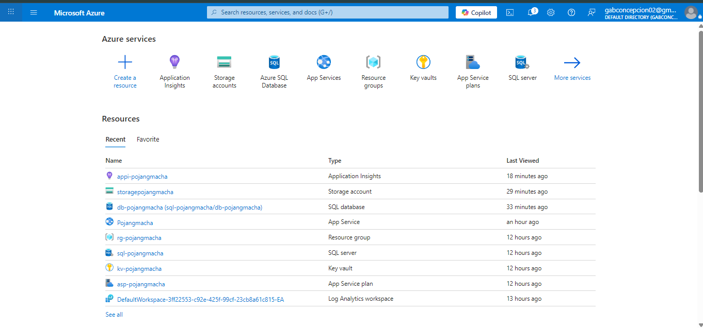
---

## Step 2 – Create Resource Group

A new Resource Group was created to organize all cloud resources for the project.

### Configuration

| Setting | Value |
|---|---|
| Resource Group Name | rg-pojangmacha |
| Region | East Asia |

### Explanation

The Resource Group acts as a container for all Azure resources related to the project.

### Screenshot
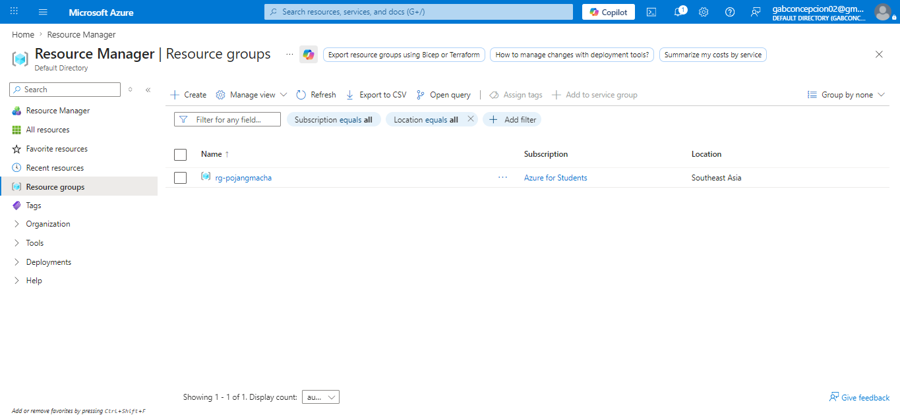
---

# 2. App Service Plan Deployment

## Step 3 – Create App Service Plan

An Azure App Service Plan was created to provide compute resources for hosting the web application.

### Configuration

| Setting | Value |
|---|---|
| Operating System | Linux |
| Pricing Tier | B1 Basic |
| Region | East Asia |

### Explanation

The B1 Basic Linux plan was selected because it provides sufficient performance for a student-scale deployment while maintaining low cost.

### Screenshot
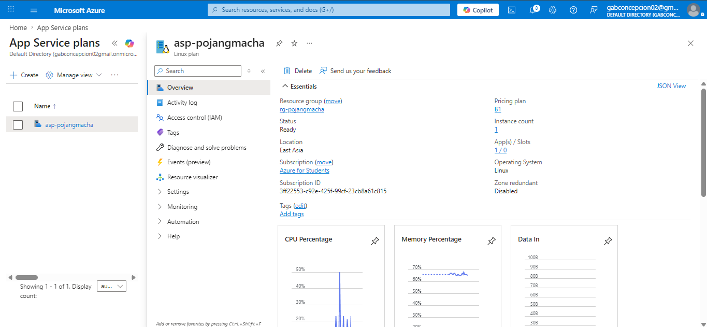
---

# 3. App Service Deployment

## Step 4 – Create Azure App Service

The Pojangmacha web application was deployed using Azure App Service.

### Configuration

| Setting | Value |
|---|---|
| Publish Method | Code |
| Runtime Stack | Python 3.11 |
| Operating System | Linux |
| Region | East Asia |

### Explanation

Azure App Service was used to host the Python Flet application with automatic deployment integration from GitHub.

### Screenshot
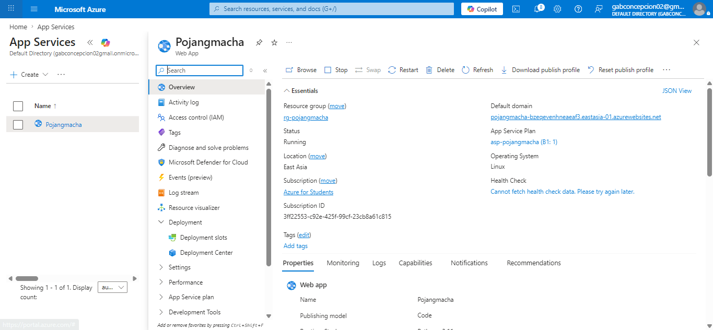
---

## Step 5 – Configure Deployment Source

GitHub deployment integration was configured for automatic CI/CD deployment.

### Configuration

| Setting | Value |
|---|---|
| Source | GitHub |
| Repository | Pojangmacha |
| Branch | main |
| Authentication | User-assigned identity |

### Explanation

GitHub Actions was enabled to automate deployment whenever code changes are pushed to the repository.

### Screenshot
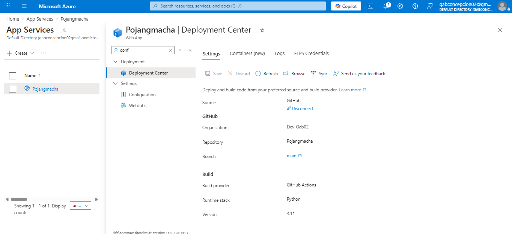
---

# 4. Azure SQL Database Deployment

## Step 6 – Create Azure SQL Database

Azure SQL Database was created to store user accounts and food menu information.

### Configuration

| Setting | Value |
|---|---|
| Database Tier | Basic |
| Region | East Asia |
| Authentication | SQL Authentication |

### Explanation

Azure SQL Database provides managed relational database services with secure cloud connectivity.

### Screenshot
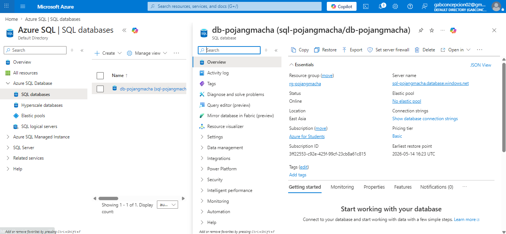
---

## Step 7 – Configure SQL Firewall Rules

Firewall settings were configured to allow Azure services and application connectivity.

### Explanation

Firewall rules were required to allow the App Service to communicate with the SQL Database securely.

### Screenshot
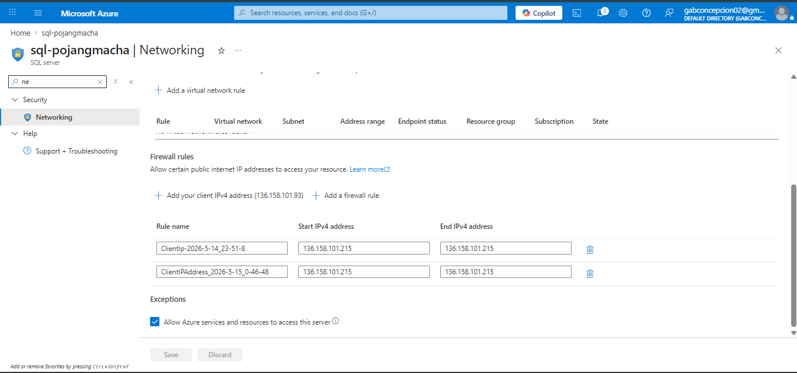
---

# 5. Azure Storage Account Deployment

## Step 8 – Create Storage Account

Azure Storage Account was created for storing uploaded food images.

### Configuration

| Setting | Value |
|---|---|
| Performance | Standard |
| Redundancy | LRS |
| Access Tier | Hot |

### Explanation

Blob Storage was selected for efficient and scalable image storage.

### Screenshot
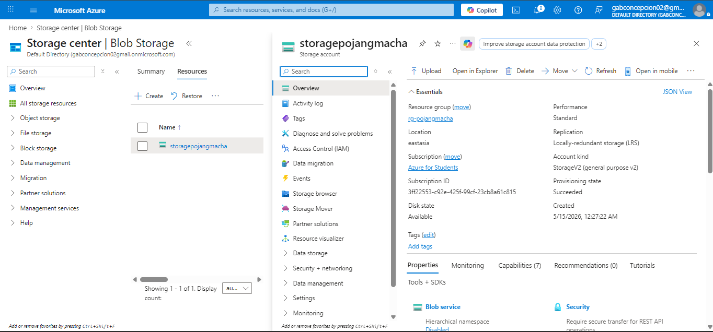
---

## Step 9 – Create Blob Container

A Blob Container named `food-images` was created for image uploads.

### Configuration

| Setting | Value |
|---|---|
| Container Name | food-images |
| Access Level | Blob (public read access) |

### Explanation

Public read access allows uploaded food images to be displayed in the web application.

### Screenshot
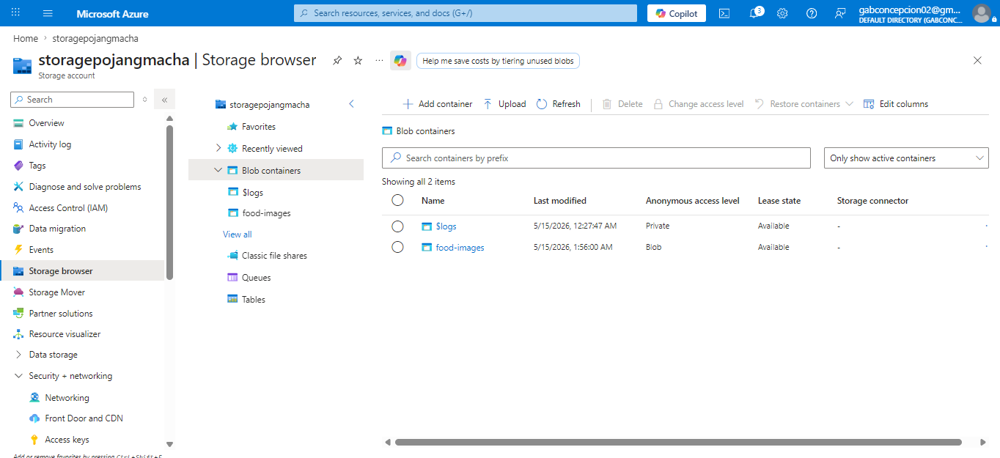
---

# 6. Application Settings Configuration

## Step 10 – Configure Environment Variables

Environment variables were added in Azure App Service Configuration.

### Variables Added

| Variable Name | Purpose |
|---|---|
| SECRET_KEY | Secret key used for application session security |
| DATABASE_URL | Database connection string |
| AZURE_STORAGE_CONNECTION_STRING | Azure Blob Storage connection string |
| AZURE_STORAGE_CONTAINER | Blob container name for uploaded food images |
| ADMIN_EMAIL | Default administrator login email |
| ADMIN_PASSWORD | Default administrator password |
| SESSION_TIMEOUT | User session timeout duration |
| SESSION_CHECK_INTERVAL | Session validation interval |
| SESSION_WARNING_TIME | Session expiration warning time |
| SMTP_SERVER | SMTP mail server hostname |
| SMTP_PORT | SMTP mail server port |
| SMTP_EMAIL | SMTP email account username |
| SMTP_PASSWORD | SMTP email account password |
| APP_NAME | Application display name |
| MAX_FAILED_ATTEMPTS | Maximum failed login attempts before lockout |
| LOCKOUT_DURATION_MINUTES | Account lockout duration in minutes |

### Explanation

Sensitive configuration values were stored securely using App Service environment variables instead of hardcoding credentials in source code.

### Screenshot
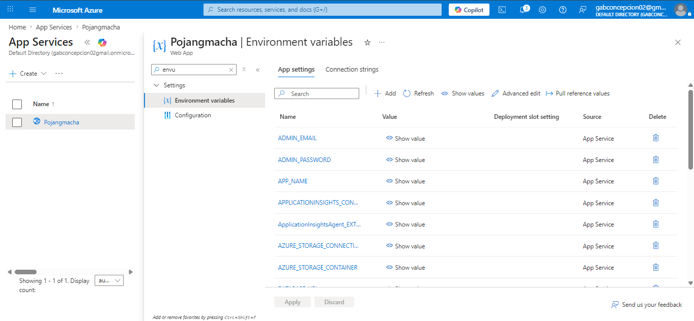
---

# 7. Security Configuration

## Step 11 – Enable HTTPS Only

HTTPS-only access was enabled for the Azure App Service.

### Explanation

This security setting ensures encrypted communication between users and the deployed application.

### Screenshot
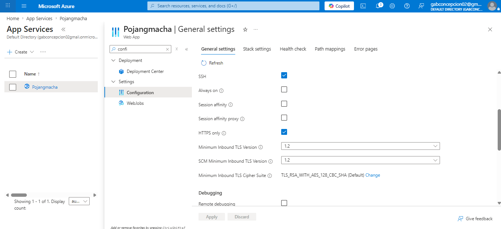
---

## Step 12 – Application Insights Monitoring

Application Insights was enabled for monitoring and diagnostics.

### Explanation

Application Insights collects logs, errors, and performance data for monitoring the deployed application.

### Screenshot
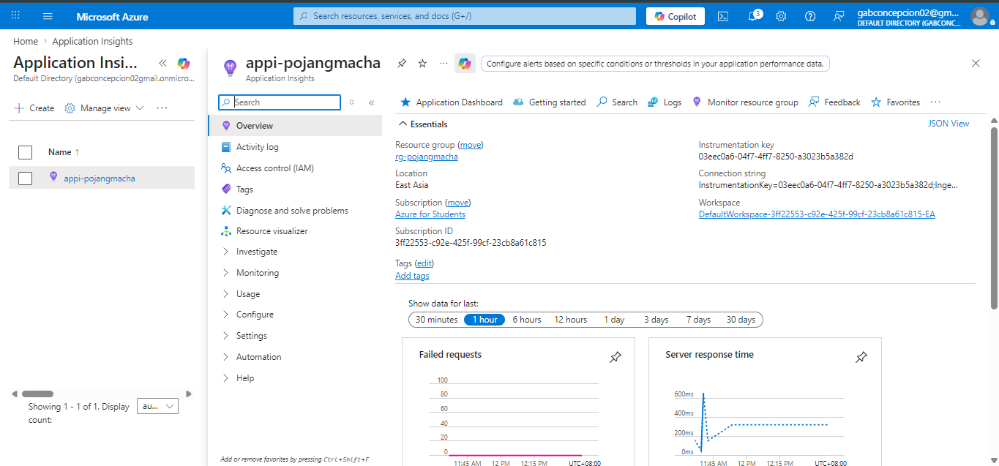
---

# 8. CI/CD Deployment Workflow

## Step 13 – GitHub Actions Deployment

The deployment pipeline automatically deploys the application whenever changes are pushed to GitHub.

### Workflow Process

1. Developer pushes code to GitHub
2. GitHub Actions workflow starts
3. Azure deployment package is built
4. App Service receives deployment update
5. Application automatically restarts with updated version

### Screenshot
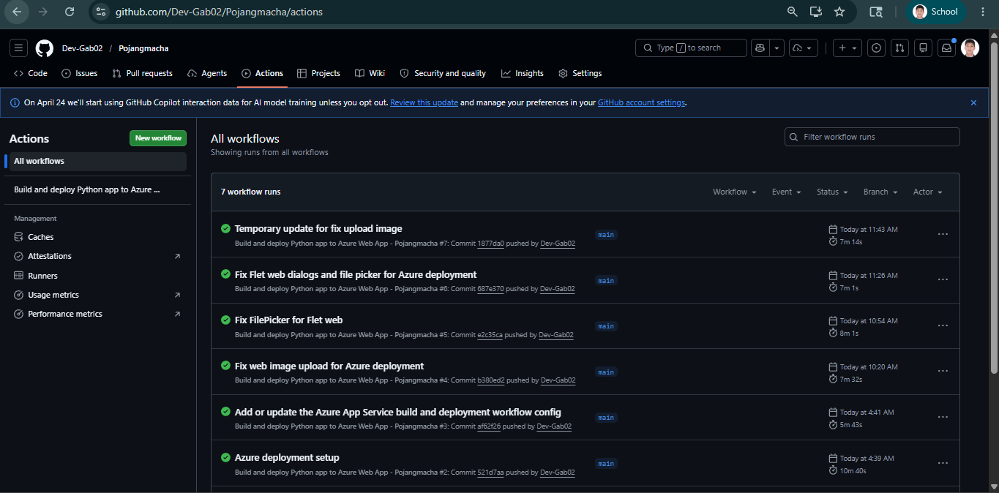

---

# 9. Final Deployment Validation

## Step 14 – Verify Live Application

The deployed application was tested successfully using the Azure App Service public URL.

### Validation Performed

- User login
- Admin login
- Food management
- Image upload
- Image display
- Database connectivity
- Blob Storage access

### Screenshot
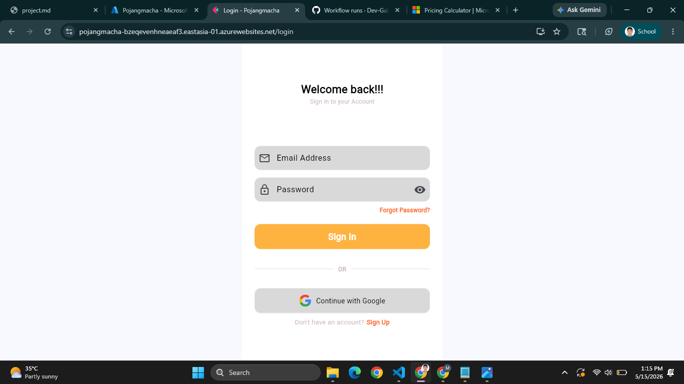
---

# 10. Security and Cloud Optimization Summary

## Security Controls Implemented

| Security Feature | Purpose |
|---|---|
| HTTPS Only | Encrypts web traffic |
| Environment Variables | Protects sensitive credentials |
| Azure SQL Firewall | Restricts database access |
| Blob Storage Access Policies | Controls image access |

---

## Cloud Optimization Features

| Optimization | Benefit |
|---|---|
| Basic App Service Tier | Reduces hosting cost |
| Standard LRS Storage | Cost-efficient redundancy |
| GitHub Actions CI/CD | Automated deployment |
| Application Insights Free Tier | Monitoring without additional cost |

---

# Conclusion

The Pojangmacha application was successfully deployed using Microsoft Azure cloud services through the Azure Portal GUI method.

The deployment demonstrates:
- Cloud-based web hosting
- Managed database integration
- Blob storage integration
- CI/CD automation
- Security configuration
- Cost optimization strategies

The application is fully operational and accessible through the Azure App Service public URL.