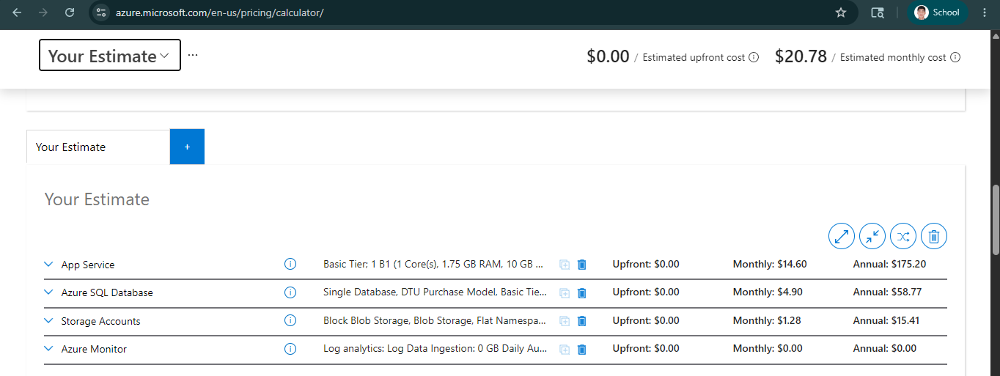

# Cost Estimate Report – Pojangmacha Azure Deployment

## Project Overview

This report provides the estimated monthly operational cost for the deployed Pojangmacha cloud application hosted on Microsoft Azure.

The application is deployed using multiple Azure services to support:
- Web application hosting
- Database storage
- Image storage
- Monitoring and diagnostics

The deployment was designed with cost efficiency and scalability in mind while still meeting the project requirements for cloud deployment and architecture optimization.

---

# 1. Architecture Summary

The Pojangmacha application is deployed using the following Azure resources:

| Azure Resource | Purpose |
|---|---|
| Resource Group | Organizes all Azure resources for the project |
| Azure App Service | Hosts the Flet-based web application |
| Azure App Service Plan | Provides compute resources for the web application |
| Azure SQL Database | Stores food menu and user account data |
| Azure Storage Account (Blob Storage) | Stores uploaded food images |
| Application Insights | Provides monitoring, logging, and diagnostics |
| GitHub Actions | Automates CI/CD deployment pipeline |

### Architecture Workflow

1. Users access the deployed web application through Azure App Service.
2. The application connects to Azure SQL Database for storing application data.
3. Food images are uploaded and retrieved from Azure Blob Storage.
4. Application logs and monitoring data are collected through Application Insights.
5. GitHub Actions automatically deploys updates to Azure whenever code is pushed to GitHub.

---

# 2. Azure Cost Estimate

The following pricing estimates were generated using the Azure Pricing Calculator.

## Estimated Monthly Cost Breakdown

| Azure Service | Pricing Tier | Estimated Monthly Cost |
|---|---|---|
| Azure App Service Plan | B1 Basic Linux | $13.14/month |
| Azure App Service | Included in App Service Plan | $0.00 |
| Azure SQL Database | Basic Tier | $4.90/month |
| Azure Storage Account | Standard LRS | $1.00/month |
| Application Insights | Free Tier | $0.00 |
| Bandwidth / Data Transfer | Estimated Usage | $1.00/month |

## Total Estimated Monthly Cost

### Estimated Total:
# **~$20.04 USD per month**

---

# 3. Pricing Calculator Screenshot

---

# 4. Cost Optimization Strategies

Several cost optimization strategies were considered during deployment:

## 1. Using Basic Pricing Tiers
The deployment uses low-cost Basic and Free tiers instead of Premium services to reduce operational expenses while still meeting application requirements.

## 2. Free Monitoring Services
Application Insights was configured using the free tier to provide diagnostics and monitoring without additional cost.

## 3. Standard LRS Storage
Azure Blob Storage uses Standard Locally Redundant Storage (LRS), which provides lower-cost redundancy suitable for small-scale applications.

## 4. CI/CD Automation
GitHub Actions automates deployment, reducing manual management overhead and improving deployment efficiency.

## 5. Future Optimization Possibilities

Additional cost reductions could include:
- Scaling down App Service during off-hours
- Using Reserved Instances for long-term deployments
- Enabling autoscaling only during peak usage
- Reducing database tier when application traffic is low

---

# 5. Conclusion

The deployed Pojangmacha cloud application demonstrates a cost-effective Azure architecture using multiple cloud services while maintaining scalability, monitoring, and deployment automation.

The estimated monthly operating cost remains affordable for a student-scale deployment while still providing real-world cloud deployment experience and production-style architecture.